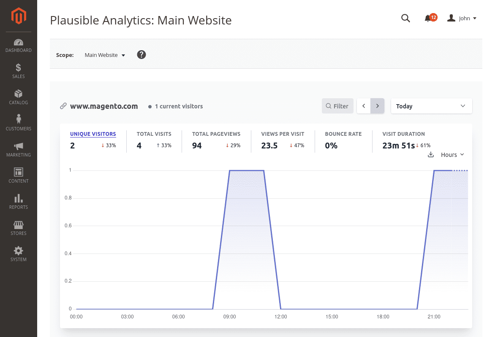
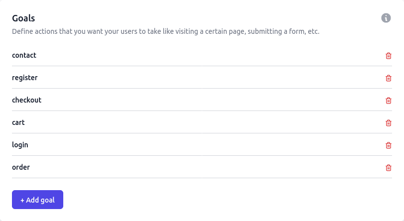
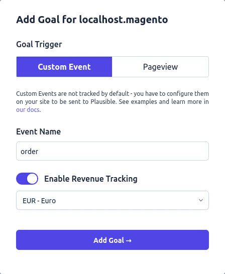

# Magento Plausible

[](https://php.net/)
[](https://business.adobe.com/products/magento/magento-commerce.html)
[](https://github.com/Pixel-Open/magento-plausible/releases)
[](https://sonarcloud.io/summary/new_code?id=Pixel-Open_magento-plausible)

## Presentation

Add Plausible Analytics to Magento.

- Save visited pages
- Access Analytics in Magento Admin with Plausible Shared Link
- Manage goals on specific actions (contact, register, checkout, order...)
- Allow use of your own Plausible instance
- Compatible with multiple websites
- Compatible with Magento OpenSource, Mage-OS and Adobe Commerce
- Compatible with Hyvä theme



## Requirements

- Magento >= 2.4.4
- PHP >= 8.0.0

## Installation

```
composer require pixelopen/magento-plausible
```

## Configuration

*Stores > Configuration > Services > Plausible*

### Tracking

| Option       | Description                                                                  |
|--------------|------------------------------------------------------------------------------|
| Enabled      | Add tracking script on frontend and start recording visited pages.           |
| Instance URL | Plausible instance URL. Allow to use a custom domain for dedicated instance. |

**Note:** For custom domain with Magento CSP Module, remember to add your instance URL in CSP whitelist for *frame-src*, *connect-src* and *script-src*.

### Admin

| Option      | Description                                                                                             |
|-------------|---------------------------------------------------------------------------------------------------------|
| Enabled     | Display stats in the "Marketing > Plausible > Analytics" menu (refresh cache when option is updated).   |
| Shared Link | Create the shared link in your Plausible instance site settings: Visibility > Shared links > + New link |

### Goals

The module includes goal events when enabled in module configuration.

- Contact message sent
- Account registration
- Customer has logged in
- Cart view
- Checkout
- Order complete

| Option        | Description                                                                      |
|---------------|----------------------------------------------------------------------------------|
| Enabled       | Allow to track actions.                                                          |
| Goal Contact  | Plausible goal name when customer send a contact message. Leave empty to ignore. |
| Goal Register | Plausible goal name when creating the customer account. Leave empty to ignore.   |
| Goal Login    | Plausible goal name when customer was connected. Leave empty to ignore.          |
| Goal Cart     | Plausible goal name when customer goes to the cart. Leave empty to ignore.       |
| Goal Checkout | Plausible goal when customer access the checkout. Leave empty to ignore.         |
| Goal Order    | Plausible goal name when customer completes an order. Leave empty to ignore.     |

You need to add goal events in your Plausible website configuration:



The Plausible goal name must be the same as the name in the module configuration.

Default goal names are:

- contact
- register
- login
- cart
- checkout
- order

### Revenue Tracking

With the goal "order", the "revenue tracking" is sent. This feature is only available with Plausible business plan.

When you add the "order" goal, you need to enable the "Revenue Tracking":



### Custom Goal

In a module, declare the new goals in the `config.xml` file:

```xml
<?xml version="1.0"?>
<!-- Vendor/MyModule/etc/config.xml -->
<config xmlns:xsi="http://www.w3.org/2001/XMLSchema-instance" xsi:noNamespaceSchemaLocation="urn:magento:module:Magento_Store:etc/config.xsd">
    <default>
        <pixel_open_plausible>
            <goals>
                <my_page_view_action>page_view_goal</my_page_view_action>
                <my_form_post_action>form_post_goal</my_form_post_action>
            </goals>
        </pixel_open_plausible>
    </default>
</config>
```

From anywhere (like a controller action), add a new Plausible goal:

```php
<?php
/* Vendor/MyModule/Controller/Example/Index.php */
declare(strict_types=1);

namespace Vendor\MyModule\Controller\Example;

use Magento\Framework\App\Action\HttpGetActionInterface;
use PixelOpen\Plausible\Session\Goals;

class Index implements HttpGetActionInterface
{
    protected Goals $goals;
    
    protected ResultFactory $resultFactory;

    public function __construct(
        Goals $goals,
        ResultFactory $resultFactory
    ) {
        $this->goals = $goals;
        $this->resultFactory = $resultFactory;
    }
    
    public function execute(): ResultFactory
    {
        $result = $this->resultFactory->create(ResultFactory::TYPE_LAYOUT);
        
        $this->goals->add('my_page_view_action')->send();
        
        return $result;
    }
}
```

When this controller is reached and the page displayed, the goal named "page_view_goal" (according the config for "my_page_view_action") is sent to Plausible.

The **send** method allows to send goals. The goal will persist until **send** method is requested for the current session.

**Note:** the page must be completely displayed before the goals are sent. The "plausible" section is refreshed when the customer data is reloaded.

Add custom properties if needed (Business Plan only):

```php
$this->goals->add('my_page_view_action', ['foo' => 'bar'])->send();
```

To send goals on a full cached page after any action, add the action in a `sections.xml` file in `etc/frontend` directory.

```xml
<?xml version="1.0"?>
<!-- Vendor/MyModule/etc/frontend/sections.xml -->
<config xmlns:xsi="http://www.w3.org/2001/XMLSchema-instance" xsi:noNamespaceSchemaLocation="urn:magento:module:Magento_Customer:etc/sections.xsd">
    <action name="mymodule/example/post">
        <section name="plausible" />
    </action>
</config>
```

To send goals from a custom RequireJS script, ask to reload the **plausible** section:

```javascript
define(
    [
        'uiComponent',
        'Magento_Customer/js/customer-data'
    ],
    function (Component, customerData) {
        'use strict';

        return Component.extend({

            initialize: function () {
                this._super();
                
                customerData.reload(['plausible'], false);
            }

        });
    }
);
```

To simply send a goal in JavaScript, use the **plausible** method:

```javascript
plausible('goalName', {'props': {'foo': 'bar'}});
```
